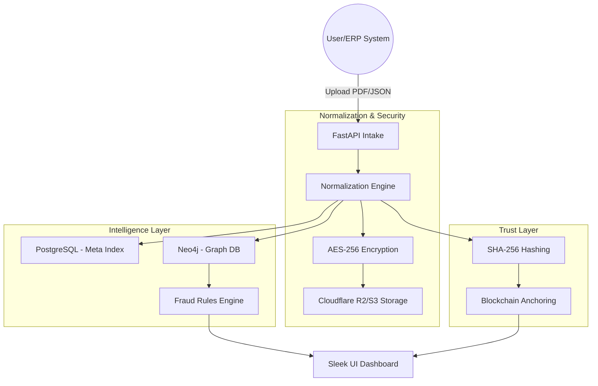

# <div align="center">GSTchain: Distributed Circular Trade Detection Ecosystem</div>


---

<div align="center">
  <strong>Combating Tax Fraud through Graph Intelligence & Blockchain Integrity</strong>
</div>

---

## ⚡ Overview

**GSTchain** is an enterprise-grade solution designed to detect and prevent **Circular Trading** (a common method of tax evasion where goods or services are rotated through layers ofShell companies to generate fraudulent Input Tax Credits). 

By leveraging **Neo4j Graph Database** for real-time cycle detection and **Blockchain Anchoring** for immutable transaction verification, GSTchain provides a bulletproof system for verifying GST (Goods and Services Tax) invoices.

---

## 🚀 Core Features

### 🔍 Graph-Based Cycle Detection (Neo4j)
Uses the power of graph algorithms to identify circular patterns:
- **Cycle Invariant Traversing**: Detects loops of any depth (A $\rightarrow$ B $\rightarrow$ C $\rightarrow$ A).
- **Rule-Based Risk Scoring**: In-built engine that scores transactions based on:
  - **Structural Rules**: Size of the closed group (2-3 nodes vs 6+ layers).
  - **Amount Correlations**: Detecting "Round-Tripping" where invoice values are nearly identical.
  - **Temporal Analysis**: Loops completed in suspicious timeframes (e.g., all on the same day).

### ⛓️ Blockchain Anchoring (Web3)
Every invoice submitted is hashed and anchored on-chain:
- **Immutability**: Once an invoice is "anchored", its details cannot be altered without breaking the hash.
- **Verification**: Public proof of transaction existence without compromising privacy.
- **Non-Repudiation**: Suppliers and recipients cannot deny the issuance of an invoice once it's on-chain.

### 🛡️ Privacy-First & Secure Storage
- **AES-256 Encryption**: Data is encrypted locally before being transmitted to the cloud.
- **Hybrid Cloud Storage**: Uses Cloudflare R2 / AWS S3 for storing the actual invoice blobs while keeping the metadata indexed in a SQL database.
- **Role-Based Access**: Secure FastAPI endpoints for ingestion, verification, and analysis.

### 📊 Advanced Fraud Dashboard
A sleek, modern interface built with **Glassmorphism** design principles:
- **Visualization**: Interactive network graphs of suspicious trade cycles.
- **GSTIN Analysis**: Detailed risk profiling for individual entities.
- **Heatmaps**: Real-time risk heatmaps of high-value circulation.

---

## 🛠️ Architecture



---

## 🏗️ Technology Stack

| Component | Technology |
| :--- | :--- |
| **Backend** | Python, FastAPI, SQLAlchemy |
| **Frontend** | Vite, Vanilla JS, CSS (Modern UI) |
| **Databases** | PostgreSQL (Relational), Neo4j (Graph), MongoDB (Document) |
| **Blockchain** | Web3.py, Smart Contracts (Anchor) |
| **Security** | Cryptography (AES-256), python-jose |
| **Storage** | Boto3 (Cloudflare R2 / AWS S3) |
| **Infra** | Docker, Docker Compose, Nginx, Redis |

---

## 🚦 Getting Started

### Prerequisites
- Docker & Docker Compose
- Node.js (for frontend)
- Python 3.10+

### Installation

1. **Clone the repository**
   ```bash
   git clone https://github.com/shlokapol2005/GSTchain.git
   cd GSTchain
   ```

2. **Configure Environment Variables**
   Create a `.env` file from the provided templates:
   ```bash
   cp .env.example .env
   ```

3. **Spin up Infrastructure (Postgres, Neo4j, Redis, MinIO)**
   ```bash
   docker-compose up -d
   ```

4. **Install Backend Dependencies**
   ```bash
   pip install -r requirements.txt
   ```

5. **Start Frontend**
   ```bash
   cd frontend
   npm install
   npm run dev
   ```

6. **Run the Backend**
   ```bash
   uvicorn app.main:app --reload
   ```


## 📄 License

Distributed under the MIT License. See `LICENSE` for more information.

---

<div align="center">
  Made by Shloka Pol & Saad Shaikh
</div>
